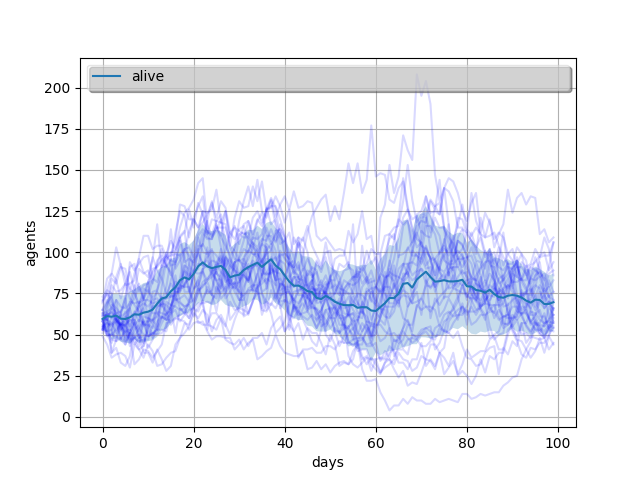
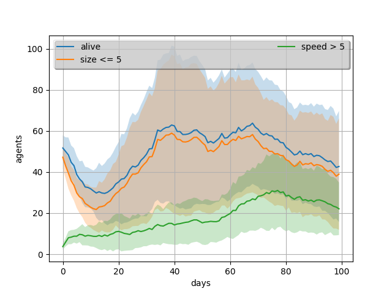
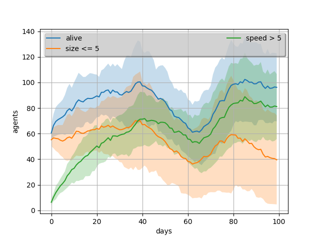

# Evolution Game

## Integrantes

- Miguel Alejandro Rodríguez Hernández - C311
- Manuel  Antonio Vilas Valiente - C311
- Andrés León Almaguer - C312

## Tabla de contenidos

[TOC]

## Introducción 

El origen de las especies ha sido siempre un punto de gran interés para la humanidad. Hace ya muchos años, en la concepción del mundo dominaba la idea metafísica, la cual tenía como esencia el concepto de la continuidad, inmutabilidad y racionalidad inicial de toda la naturaleza. La Tierra, sus continentes, montes, clima, así como las especies de plantas y de animales serían perpetuos e inmutables.

Gracias a muchas investigaciones posteriores, en especial a las realizadas por Charles Darwin, esta idea cambió, y el concepto de evolución de las especies entró al juego. El mérito principal de Darwin consiste en que descubrió las fuerzas motrices de la evolución y explicó bajo el punto de vista materialista el origen y el carácter relativo de la adaptación como resultado solamente de la acción de leyes naturales sin la intervención de cualesquiera fuerzas sobrenaturales. La teoría de Darwin destruyó totalmente las ideas metafísicas acerca de la inmutabilidad de las especies. ¿Cuáles son las fuerzas motrices de la evolución de las razas de animales, las variedades de las plantas de cultivo y especies en la naturaleza salvaje?

> *La lucha por la existencia y la selección natural a base de la mutación hereditaria son, según Darwin, las fuerzas motrices principales (factores) de la evolución del mundo orgánico.*

La selección natural puede ser expresada con la siguiente ley general, tomada de la conclusión de *"El origen de las especies"*:

> Existen organismos que se reproducen y la progenie hereda características de sus progenitores, existen variaciones de características si el medio ambiente no admite a todos los miembros de  una población en crecimiento. Entonces aquellos miembros de la población con características menos adaptadas (según lo determine su medio  ambiente) morirán con mayor probabilidad. Entonces aquellos miembros con características mejor adaptadas sobrevivirán más probablemente.

Con estas bases sentadas, fue realizado este proyecto, cuyo objetivo principal es simular el comportamiento de diferentes poblaciones de agentes, que serían los seres vivos en nuestro caso, en un entorno cerrado, donde estos deben de conseguir comida para poder sobrevivir y reproducirse. Al lograr esto último, dichos agentes pueden variar las composición de sus genes, que van desde el mecanismo de reproducción, el tipo de alimentación, o las capacidades que los hacen más o menos aptos para la supervivencia, lo que a su vez puede dar al traste con el cambio de su comportamiento. A lo largo del desarrollo del mismo hemos utilizado el conocimiento aprendido a lo largo del curso en las asignaturas de Simulación, Inteligencia Artificial y Compilación.

### Lenguaje y Requerimientos

El lenguaje de programación usado en el desarrollo del proyecto fue [Python](https://www.python.org), elegido sobre todo por el dominio de los desarrolladores, y por el uso de algunas librerías que permitirían facilitar la implementación de algunas característas, que en este caso son [matplotlib](https://matplotlib.org), utilizada para graficar las estadísticas de cada una de las simulaciones, y [numpy](https://numpy.org), usada para el cálculo con matrices. 

Para el uso del proyecto se recomienda Python 3.9.xx e instalar estas librerías:

```bash
$ pip install matplotlib numpy
```

### ¿Cómo utilzarlo?

Para ejecutar el código en el lenguaje, se debe ejecutar en una consula situada en la raíz del proyecto la siguiente línea de comandos:

```bash
$ python main.py program.evo
```

## La simulación

La simulación tendrá lugar dentro de un mundo bidimensional de casillas donde un conjunto de agentes inteligentes intentarán sobrevivir y reproducirse al competir por comida mientras que en el transcurso de los días, entiéndase día como un ciclo completo de la simulación, los descendientes de estos van a ir variando sus genes o características representativas tratando de acercarse a como funciona la evolución. Un agente sobrevive si en un día logra comer al menos una vez y regresar al borde, y un agente se reproduce si logra alimentarse más de una vez y de igual manera, regresar a un borde.

### El mapa 

El mundo esta representado por una clase `World`, que será el espacio donde ocurrirá la simulación, se encontrarán los agentes y otros objetos esenciales a la simulación. Este, a su vez, está compuesto por un `map`, que no es más que un arreglo de dos dimensiones, con unas dimensiones `x` y `y` que determinan el tamaño de este como el de la simulación en si, y posee en cada posición un objeto `Tile`. En esta clase tenemos un conjunto de métodos que permiten trabajar con las instancias de `Tile`, que nos facilitan informaciones estas, como saber si en dicha celda existe comida (`Food`), hay un árbol (`Tree`), es un borde, etc. En general, con esta clase podemos gestionar todo lo que sucede en el mundo donde transcurre la simulación.

La clase `Tile` es la unidad atómica de espacio en nuestro mundo. El tile tiene un conjunto de propiedades como son sus coordenadas `x` e `y`, si es un borde, si tiene comida (`Food`), agentes (`Agent`) o un árbol (`Tree`), así como un valor entero que determina la altitud del mismo dentro del mundo, una lista objetos (`Object_base`) que se encuentran dentro de la casilla y la lista de marcas de pisadas.

La clase `Objetc_base` servirá de molde para las clases que heredaran de ella y tiene como principal propiedad sus coordenadas. De esta tenemos como herederas a `Food`, `Tree` y `Agent`. La primera intuitivamente representa la comida que los agentes que presenten el tipo de alimentación omnívora y herbívora deben consumir para poder subsistir. Y los árboles tendrían la particularidad de ser localizaciones alrededor de las cuales tiende a existir un mayor número de comida, aunque poseen un tiempo de vida máximo. Los árboles también aparecen, con muy poco probabilidad, en un lugar donde hubo comida.

### Los agentes 

Los agentes tienen en las simulaciones un papel protagónico, pues podemos decir que la mayoría de las funciones dentro de las mismas los tienen a ellos como centro, y las interacciones entre estos y el ambiente es el objeto cuasi principal dentro dentro del proyecto, medir la cantidad de agentes dado un conjunto de simulaciones y parámetros a observar, cuál fue su comportamiento y cuáles eran las características que los definían nuestras principales variables de estudio.

La clase `Agent`, que representa al individuo que interactúa con el ambiente, está definida por su posición en el `map` (x,y), una lista de genes representativos del código genético que van a definir sus características, un `Behavior` que determina el conjunto de reglas (`rules`) que determinarán su comportamiento y de estados (`states`) en el que el agente puede encontrarse. 

Al definir un nuevo agente serán definidas algunas de sus propiedades como que está vivo (`is_alive`) su edad a 0, sus genes a partir de los genes usados como parámetros en el constructor, su energía máxima a partir del gen de *stamina*, la duración de su vida a partir del gen *life*, una función de consumo de energía predefinida. Tanto los estados como las reglas pueden ser definidos en el constructor y, en caso de no existir, una instancia de `Behavior` se encargará de darle al agente un comportamiento por defecto.

Dentro de los métodos que posee esta clase se encuentran aquellos que tienen que ver con el uso de su código genético, con los que podremos cambiar genes individuales o el conjunto entero de ellos así, como preguntar si el agente posee alguno en específico. Dentro de estos también tenemos los métodos de reproducción de los individuos en sus variantes sexual o asexual. En el caso de la reproducción sexual el resultado de la unión de dos individuos dará como resultado una lista de agentes que su tamaño dependerá del gen *fertility*, y estos hijos poseerán el comportamiento, `behavior`,  de alguno de los padres, además de que su configuración genética será una suma de los códigos de los padres. El caso de la reproducción asexual da como resultado un hijo con el mismo `behavior` que su progenitor y con un código genético alterado o mutado a partir del de su padre.

Otros del los métodos definidos dentro de la clase están aquellos relacionados con el movimiento y la apreciación del mapa de los agentes. Para observar el medio, los agentes tienen definido un gen sensorial, el cual indica cuántas casillas a su alrededor son capacer de apreciar. Las reglas del `behavior` del agente poseen una función reservada precisamente para el momento de la visualización, con esta, dicho agente analiza cada objeto que está observando y verifica si le es o no relevante para su futuro comportamiento. Finalmente, es devuelta una percepción del mundo.

Los agentes poseen  una arquitectura de capas horizontales, en esta topología, cada capa está conectada directamente al sensor de entrada y a la función de movimiento. De esta forma, cada capa actúa como un agente, produciendo sugerencias sobre que acción se debe realizar. Estos, a su vez, cumplen con las características necesarias para ser considerados inteligentes. Son reactivos, ya que tienen la capacidad de percibir el ambiente y responder de un modo oportuno a los cambios que ocurren para lograr sus objetivos; son pro-activos, ya que modifican su comportamiento y plan de acción en correspondencia a su estado actual; e interactúan con otros agentes para lograr dichos objetivos, aplicando la sociabilidad.

#### El movimiento

Este método recibe la percepción del mundo, o sea, los límites de la observación del agente, y en este espacio realiza un conjunto de movimientos. El mejor camino posible para encontrar alimento, se pudiera calcular usando el algoritmo de Dijsktra, pero en términos de costo, esto representaría una opción muy lenta. Entonces, ¿qué hacer? Los agentes tienen, como ya dijimos, un conjunto de estados y un conjunto de reglas que definirán su comportamiento, entonces, ¿cómo estos pueden realizar un conjunto de movimientos inteligentes y que calcular dicho plan de acción no se vuelva algo poco eficiente? Pues, para resolver esto, los agentes calculan la probabilidad de que moverse hacia una posición sea lo mejor. 

En el comportamiento por defecto, definimos un grupo de variables a tener en cuenta, que son:

1. la distancia a la que están los alimentos,
2. la distancia a la que están los árboles,
3. la distancia a la que se encuentran los enemigos,
4. la distancia a la que se encuentran las posibles parejas,
5. la distancia a la que se encuentran los bordes,
6. la diferencia de altura entre una casilla y otra,
7. si la casilla ya la visitamos antes y
8. qué cantidad de marcas de pisadas hay en la casilla.

Para mejorar el problema de "lo más cerca de un grupo de objetos (la media), puede no llevarme nunca hacia un objeto en sí", no usamos la media común, sino una medida que aprendimos en el curso de SRI, con la cual se obtiene un valor que nos acerca al mínimo de los valores de una lista de números. Dada una lista de números $X$, se define la media como:
$$
mean(X) = \frac{N}{\sum_{i = 1}^N \frac{1}{x_i}}
$$
donde $N$ es el tamaño de la lista. En caso de $x_i = 0$, se asume que $1/x_i = 1$.

La fórmula general implica maximizar la distancia con respecto a las amenazas, y minimizar las distancias con respecto a los elementos beneficiarios.

Pero, si un agente ya se alimentó, quizás no debería ser muy importante para él volver a comer, ¿cómo solucionamos eso? Pues, para eso está la última función de cada `Rule` del `behavior`. Esta función nos indica cuán relevante debe ser, según el estado actual del agente, una de las reglas. Por ejemplo, si ya un agente está embarazado, no necesita seguir dándole importancia a la búsqueda de parejas, y el coeficiente de relevancia de esta regla será $0$. Lo mismo pasa con los bordes, si estos ya se alimentaron, no es necesario seguir vagando por el mapa, por lo cual la importancia para la mayoría de las reglas pasa a ser $0$, y la de la cercanía con los bordes pasa a ser la mayor, 1.

De esta forma, el agente en cada turno sabe qué debe priorizar para garantizar su supervivencia y su reproducción, realizando un movimiento relativamente inteligente al asociar en cada momento una relevancia a cada una de sus capas, en correspondencia con su estado actual.

### Las acciones

Existe una clase, nombrada `Action`, que determina una acción que podrá ser ejecutada por el agente en el mundo. De esta heredan un conjunto de definiciones como `DoNothing`, `MoveNorth`, `MoveSouth`, `MoveEast`, `MoveWest`, `Eat` y `HaveSex` que, como sus nombres sugieren, están atadas a los movimientos hacia los diferentes puntos cardinales, y a la alimentación y la reproducción sexual de los seres de la simualción.

### Los genes 

Como explicamos previamente, el código genético de cada individuo determina en buena medida su actuar, al incidir directamente en las reglas que definen su `behavior`. Con el objetivo de poder variar parámetros dentro de las características de los individuos surge esta clase `Gene`, que va a representar cada uno de los genes del agente, y la clase `GeneticCode`, que representa al conjunto de estos genes.

Cada `Gene` está definido por los valores mínimo y máximo que puede alcanzar, el valor actual que posee,  estos de tipo entero, las probabilidades de mutar y mutar hacia arriba, de tipo *float*, y el tamaño del cambio que pueden llegar a realizar. La suma o unión de dos genes esta definida por default como el truncamiento a entero de la media de los valores de los genes. Al mutar un gen, se devuelve un nuevo gen su valor aumentado o decrecido, en correspondencia con los valores de aleatorios obtenidos. Además, `Gene` da la posibilidad de implementar nuevas funciones de mutación para si mismo.

Dentro de los genes definidos para la simulación se encuentran:

- `Sense`:  Define la capacidad del agente de percibir el medio que le rodea.
- `Size`: Define su tamaño.
- `Speed`:  Velocidad del agente, lo que determina la cantidad de casillas que puede desplazarse por ronda.
- `Reproduction`: Tipo de reproducción que posee el agente, sexual o asexual.
- `Life`: Duración de la vida del agente.
- `Diet`: Tipo de comida que consume, puede ser herbívoro, carnívoro u omnívoro.
- `Sex`: Sexo del agente, posee dos estados asexual o sexual.
- `Fertility`: Capacidad del agente de poseer un mayor número de descendientes.
- `Stamina`: Cantidad de energía del agente, necesaria para desplazarse.


#### Tabla de valores por defecto de los genes 

|      Gen       | min_value | max_value | value | chance_to_mutate | chance_to_go_up | step |
| :------------: | :-------: | :-------: | :---: | :--------------: | :-------------: | :--: |
|    `Sense`     |     1     |    10     |   5   |       0.5        |       0.5       |  1   |
|     `Size`     |     1     |    10     |   5   |       0.5        |       0.5       |  1   |
|    `Speed`     |     1     |    10     |   5   |       0.5        |       0.5       |  1   |
| `Reproduction` |     1     |     2     |   1   |       0.5        |       0.9       |  1   |
|     `Life`     |     1     |    20     |  10   |       0.5        |       0.5       |  1   |
|     `Diet`     |     1     |     3     |   1   |       0.1        |       0.8       |  1   |
|     `Sex`      |     1     |     2     |   1   |        1         |        0        |  1   |
|  `Fertility`   |     1     |     8     |   4   |       0.5        |       0.5       |  1   |
|   `Stamina`    |    100    |   1000    |  400  |       0.5        |       0.5       |  10  |

En los casos de *Sense*, *Size*, *Speed*, *Life*, *Fertility* y *Stamina*, su capacidad de mutar estará definida por el modo estándar explicado anteriormente. Pero en los casos de *Reproduction*, *Diet* y *Sex*, estos tendrán sus propios métodos de mutación. La mutación en la *Reproduction* sólo posee dos valores que representan el 1 del tipo asexual y el 2 del tipo sexual, y las probabilidades de pasar de 1 a 2 (9/10) son mucho mayores que de 2 a 1 (1/9). El caso de *Diet* esta compuesta por una terna 1 herbívoros, 2 carnívoros y 3 omnívoros, al poseer altas posibilidades de mutar hacia arriba estos tenderán a mutar hacia omnívoros dado que si están en estado 1 y mutan tendrán una probabilidad del 4/5 de pasar al estado 3, ocurre lo mismo de con 2 con mayor tendencia hacia estado 3, y en el caso de poseer alimentación omnívora tendrá igual oportunidad de pasar a 1 o 2. El *Sex* tiene dos estados 1 femenino ♀ y 2 masculino ♂, los cuales toman con igual probabilidad cualquiera de los dos valores. 

El `GeneticCode` está compuesto por un diccionario de nombre del gen a `Gene`, y será definido por una lista de genes no predeterminados descritos por el usuario, que serán combinados con los estándares. Además de brindar las opciones de unir dos cadenas, mutar todos los genes de una cadena y preguntar por la existencia del algún `Gene` .

### El comportamiento

El comportamiento de los agentes está desacoplado de estos en sí, y se encuentra representado a través de la clase `Behavior`. Esta clase se encargará de agrupar las diferentes reglas y estados de comportamiento de los agentes. Cuando se inicializa, se construye el funcionamiento por defecto establecido, y además, son agregados todos los datos que el usuario desee modificar.

La capacidad de crear un objeto `Behavior` sin necesitar un agente, nos da la facilidad de diseñar un molde con el cual podrán funcionar varios agentes, sin tener que definir el mismo comportamiento una y otra vez.

Ahora, ¿qué son las reglas y los estados?

#### Las reglas

Las reglas están representadas por la clase `Rule`. Un objeto de este tipo, contendrá tres funciones, la primera `to_see`, es la función que define un comportamiento a la hora de observar el mundo, debe recibir un agente y un objeto, y retornar un valor booleano, True || False en dependencia de si un objeto cumple con una restricción con respecto al agente.

La segunda función, `to_move`, es la función que define cómo el agente valora una posición a la hora de moverse. A esta se le pasarán como parámetros una celda actual, una celda a la que nos moveremos, un mundo, un lista de las  casillas ya vistas y una lista de elementos relevante, retorna un valor numérico.

La última función es `to_relevance`, esta indica cuán relevante es una regla en dependencia del estado actual del agente. Debe retornar un valor entre 0 y 1.

Hay un conjunto de reglas ya definidas, las cuales se determinan el comportamiento predeterminado para un agente, estas son:

| Nombre de la regla              | Función                                  |
| ------------------------------- | ---------------------------------------- |
| `EatRule` *("food")*            | Regla para la alimentación.              |
| `TreeRule` *("tree")*           | Regla para los árboles.                  |
| `EnemiesRule` *("enemies")*     | Regla para las parejas.                  |
| `ElevationRule` *("elevation")* | Regla para las diferencias de elevación. |
| `EdgeRule` *("edges")*          | Regla para los bordes.                   |
| `FootprintRule` *("footprint")* | Regla para las marcas de las pisadas.    |
| `VisitedRule` *("visited")*     | Regla para las casillas ya visitadas.    |

#### Los estados

Los estados son representados a través la clase `State`. Un objeto estado posee un nombre, y una función que define si un agente se encuentra ahora en este estado, por lo cual recibe un agente, y retorna `True || False`.

Los estados predeterminados son:

| Nombre del estado | Función                                            |
| ----------------- | -------------------------------------------------- |
| *"starve"*        | El agente no ha comido en el día                   |
| *"half"*          | El agente está medio lleno, ha comido una sola vez |
| *"full"*          | El agente está lleno, ha comido más de una vez     |
| *"pregnant"*      | El agente está embarazado                          |
| *"low_energy"*    | Al agente le queda menos de la mitad de la energía |

### Las marcas en el suelo

También encontramos la clase `Footprint`, la cual se usa para representar las pisadas dejadas por un agente al trasladarse por una casilla, usada para ayudar a las agentes a tener un método de orientación dentro del terreno, ya que los agentes se mueven buscando comida y es probable que seguir a uno nos lleve a una buena posición. Funciona parecido a la idea de la metaheurística de la colonia de hormigas.

### El simulador

`Simulator` es la clase que controla los procesos internos de la simulación, la pone a funcionar, es la que posee al mundo (`world`) y a los agentes. Además, posee otras propiedades como el día actual de la simulación, alguna función de restricción para detener la simulación, y una función que se encargará de distribuir la comida en cada ciclo, o día. Tenemos otros métodos, los cuales se basan fundamentalmente en variar cada uno de los atributos de la simulación, entre ellos, la adición o eliminación de agentes, etc. 

Cada simulación esta dividida en días o ciclos, por cada día se pasa a ubicar la comida en los `Tiles` a partir de la función, se simula una ronda donde cada uno de los agentes ejecuta un plan de `Actions`, se eliminan de esta aquellos que no pudieron llegar a conseguir comida, se reproducen aquellos que cumplan las condiciones para ello y se reinician sus estados para la próxima ronda, así hasta que se llega al final de los días seleccionados por el usuario. Las estadísticas de cada unas de estas rondas son recogidas para luego ser mostradas. 

Un detalle importante son las funciones de filtrado de agentes, con estas es que logramos concentrarnos en características específicas de estos, y el estudio del comportamiento de la simulación se nos hace más completo.

### El simulador maestro

La clase `SimulatorMaster` es la clase utilizada para generar un conjunto de simulaciones con las mismas características, y poder extraer de ellas cuáles son los comportamientos generales que deben esperarse dadas unas condiciones iniciales. Su método `run` no hace más que ejecutar dicho modelo de simulación una cantidad de rondas preestablecidas, y luego, son mostradas y graficadas las estadísticas generales obtenidas tras todas las corridas.

En la configuración estándar, lo que es mostrado es la media de comportamiento de las variables a observar por simulación, y además una banda de valores que se comprenden entre la media y la desviación típica.

### Uso del Framework en Python puro

#### Ejemplo 1

- Definir un agente con todos los parámetros por defecto.

```python
import evolution

agent_1 = evolution.Agent()
```

#### Ejemplo 2

- Definir nuevos genes y con ellos definir un agente.

```python
# Gen de la reproducción, con valor 2 (sexual), y ninguna posibilidad de mutar
gen_1 = evolution.Reproduction(value=2,chance_to_mutate=0)
# Gen de dieta, con valor 2 (carnívoro), y siempre mutaría hacia omnívoro
gen_2 = evolution.Diet(value=2, chance_to_go_up=1)
agent_2 = evolution.Agent(genes=[gen_1, gen_2])
```

#### Ejemplo 3

-  Se crea un `behavior` y este es asigando a un nuevo agente.

```python
behavior_1 = evolution.Behavior() # Behavior por defecto
agent_3 = evolution.Agent(behavior = behavior_1)
```

#### Ejemplo 4

- Se definen nuevas funciones y reglas para conformar un comportamiento para un agente.

```python
# Definiendo una función para hacer relevante un elemento para un agente
def diet(agent, element):
    if element.is_agent == True and element.genetic_code.get_code('diet') > 2:
        return True
    
# Definiendo una función para el movimiento del agente
def diet_move(*args):
    if len(elements) > 2:
        print(2)
    return 0

# Creando una regla de alimentación, donde la relevancia para comer es siempre 0.8, sin importar el estado del agente.
rule_1 = evolution.EatRule(to_relevance=lambda *args: 0.8)

# Creando una regla desde cero, nombrada 'diet', asignando las funciones creadas a la regla
rule_2 = evolution.Rule('diet', to_see = diet, to_move=diet_move, to_relevance=lambda *args: 0.5)

# Creando un nuevo behavior con las reglas creadas
behavior_2 = evolution.Behavior(rules=[rule_1, rule_2])

# Creación de un agente con genes y comportamiento definidos
agent_4 = evolution.Agent(genes=[gen_1, gen_2], behavior=behavior_2)
```


#### Ejemplo 5

- Definir un agente a partir de genes y reglas definidas.

```python
agent_5 = evolution.Agent(genes=[gen_1], rules=[rule_1, rule_2])
```

#### Ejemplo 6

- Definición de varias funciones de filtrado de agentes.

```python
# Función de filtrado 1
def func(ag: evolution.Agent):
    if (ag.genetic_code.get_gene('speed').value > 5):
        return True
    else:
        return False

# Función de filtrado 2
def func2(ag: evolution.Agent):
    if (ag.genetic_code.get_gene('size').value <= 5):
        return True
    else:
        return False

# Función de filtrado 3
def func3(ag: evolution.Agent):
    if (ag.is_alive):
        return True
    else:
        return False
    
# Función de filtrado 4
def func4(ag: evolution.Agent):
    if (ag.genetic_code.get_gene('reproduction').value == 2
        and ag.genetic_code.get_gene('fertility').value > 4):
        return True
    else:
        return False
```


#### Ejemplo 7

- Crear un simulador en un mundo de 50x50.

- Define una función de comida.

- Agrega 5 agentes y corre dicha simulación por 100 días mapeando los agentes que cumplen las funciones 1, 2, 3 y 4.
- Ejecuta 100 días de la simulación.

```python
s = evolution.Simulator()
s.create_world(50, 50, 10)

def func_food(simulation):
      return 500 - simulation.day

for i in range(5):
    s.add_agent_to_simulation(evolution.Agent())


s.simulate(days = 100,
           food_function=func_food,
           maping=[evolution.MapFunction('speed > 5',func),
                   evolution.MapFunction('size <= 5',func2),
                   evolution.MapFunction('alive',func3),
                   evolution.MapFunction('sexual & fert > 4',func4)],
           plot=1)
```


#### Ejemplo 8

- Se crean nuevas reglas para los enemigos y las celdas visitadas.

- Se crea un behavior modificado con las reglas nuevas.

- Se define una función de distribución de agentes.

- Se crea una simulación maestra, con 10 árboles iniciales, 30 rondas de simulaciones, y una duración de 100 días.
- Son asignadas las funciones de distribución de agentes y distrubición de comidas.
- Se ejecuta la simulación maestra, teniendo en cuenta tres parámetros.

```python
enemies = evolution.EnemiesRule(to_relevance=lambda *args: -1)
visited = evolution.VisitedRule(to_relevance=lambda *args: 1)

behavior_3 = evolution.Behavior(rules=[enemies,visited])
def func_agent():
      return [evolution.Agent(behavior = behavior_3) 
              for i in range(50)]
      
sm = evolution.MasterSimulator(trees=10, rounds=30, days=100)
sm.food_distribution = func_food
sm.agents_distribution = func_agent

sm.run(maping=[evolution.MapFunction('alive', func3),
            evolution.MapFunction('size <= 5',func2),
            evolution.MapFunction('speed > 5',func)])
```

### Ejemplos de los gráficos

#### Simulaciones independientes
<table>
    <tr>
        <td><center></center></td>
        <td><center></center></td>
    </tr>
</table>
#### Simulaciones maestras

`plot = means = True`



`plot = False & means = True`
<table>
    <tr>
        <td><center></center></td>
        <td><center></center></td>
    </tr>
</table>
## El compilador

El proceso de compilación está compuesto por cuatro momentos fundamentales:

- Primer momento ->  Análisis léxico: Se toma un `string`, que sería el programa, para luego transformarlo en una lista de *tokens*.
- Segundo momento -> Análisis sintácitico: Se toma la lista de *tokens* y se construye con ellos un Árbol de Sintaxis Conctreta (*CST*).
- Tercer momento -> Análsis semántico: El *CST* es tranformado a Árbol de Sintaxis Abstracta (*AST*), al cual luego se le es realizado un chequeo semántico.
- Cuarto momento -> Ejecución del programa.

### Análisis léxico

Como se decía, un `string` es tomado y covertido en una lista de *tokens*, ¿qué es un *token* para nosotros? Un *token* posee un tipo, un lexema, una fila y una columna. El tipo es el identificador asignado al *token* (Ej. *If, Else, String, Number*); el lexema es el `string` con el que el *token* es representado en la cadena, que tendría como objetivo guardar el valor del *token* en cuestión; y la fila y la columna permitirían tener el conocimiento de dónde se encuentra ubicado el *token* en la cadena del código fuente, lo cuál podría ser utilizado a la hora de marcar en qué posición se ubican los posibles errores sintácticos. 

Un patrón es una cadena de caracteres (Ej. *if*) al cual se desea asignar un *token* específico. Estos patrones son reconocidos a través de los autómatas, los cuales son definidos en el archivo `automata.py`, donde se encuentran las clases `State`, `FiniteState` y `Automata` . Un autómata no es más que un conjunto de estados, un estado inicial, un conjunto de estados finales y unas funciones de transición.

El objetivo es lograr las tuplas `<patron, token>`. Para reconocer los patrones se tiene un módulo de expresiones regulares `regex`, que simplemente toma un `string`, que es un patrón, y lo convierte en expresiones regulares básicas, que son la concatenación, el `or` y la clausura. Esto se realiza a través de un algoritmo de *Shunting yard*, y la expresión regular obtenida es llevada a un autómata. A partir del conjunto de atómatas finitos deterministas obtenido, se crea uno finito no determinista que reconozca a todos los patrones. Posteriormente, este último será transformado a un autómata finito determinista, ya que es más sencillo de simular.

Entonces, ¿cómo se procede? Se recorre todo el `string` del programa mediante la clase `Lexer`, cada caracter observado es transferido al autómata finito determinista, cuando este se detiene, entonces queda determinado el *token* en cuestión, o lanza error si el patrón no coincide con ningún *token*. Luego de haber visto cada uno de los caracteres del programa, quedan identificados todos los *tokens* y es devuelta una lista con ellos.

### Análisis sintáctico

En el paso de análisis sintáctico se toma la lista de *tokens* devuelta por el análisis léxico y con estos se genera el árbol de sintaxis concreta. El `parser` implementado es *LL(1)*, para esto se garantiza que la gramática diseñada no es recursiva a la izquierda ni es ambigua. En el archivo `grammar.py` están codifcados todos los elementos necesarios para la confección de una gramática, símbolos, terminales, no-terminales, producciones y la gramática en sí. Dentro de es esta última se encuentran los métodos `First` y `Follow`. El `parser`  es ejecutado con la lista de *tokens*, la tabla de *parse* y la gramática, y al culminar queda conformado el *CST*.

Aquí cabe resaltar que la gramática diseñada es L-atributada, esto es así ya que los atributos son de tipo L, lo cual significa que los atributos pueden ser heredados o sintetizados, y en caso de ser heredados, entonces únicamente el valor de un atributo puede depender de los valores de los que se encuentran a la izquierda de él o encima, no es posible que un valor dependa de un nodo a la derecha o de un valor que no esté calculado. Los símbolos en este caso poseerían dos atributos, *ast* y *l_attribute*, los cuales servirán luego para pasar al *AST*.

Entonces, se tienen estos dos atributos por cada símbolo, cada vez que es encontrado un no-terminal, se crea un nuevo nodo y se le asigna como sus hijos a los símbolos que se obtienen del cuerpo de la producción que fue aplicada en este momento en el `parser`.  Las producciones poseen reglas, las cuales se aplican cuando se va a pasar del árbol de sintaxis concreta al árbol de sintaxis abstracta, e indican el cómo se realiza este proceso.

### Análisis semántico

El análsis semántico se ejecuta sobre el *AST* obtenido en el paso anterior. En este momento, en la mayoría de los casos el chequeo semántico de un nodo es validado si el chequeo semántico de sus nodos hijos es validado correctamente. En otros casos, además del anterior criterio, se verifica que el tipo sea adecuado con la operación que se desea hacer. 

### Ejecución

Por último, se pasa a la ejecución del programa que ha quedado contenido en el *AST*. Cada nodo del árbol sabe cómo ejecutarse, por ende, sólo es necesario mandar a ejecutar al nodo raíz para que todo el programa sea corrido.

## El lenguaje EVO

### Panorama general

EVO es un lenguaje de programación de tipado estático. El lenguaje permite a los desarrolladores programar soluciones a diversos problemas. El lenguaje está dirigido a facilitar el uso del *framework*  desarrollado para la representación de las simulaciones. La ejecución de un programa escrito en EVO se hace en el lenguaje *python*, pues el compilador transforma el código EVO a código *python*.

#### El primer programa

```python
print("hello world");
```

Nuestro lenguaje se ejecuta de manera secuencial, de arriba hacia abajo. Por lo tanto para escribir en la consola `"hello world"` en nuestro lenguaje basta con declarar en la primera línea la función *built-in* **print**. Esta función funciona idénticamente a la de *python*, por lo que es capaz de imprimir los tipos que se usan en el lenguaje. Para señalar en final de una instrucción se utiliza el punto y coma.

#### Tipos y variables

Como el lenguaje fue pensado para trabajar en conjunto con un framework de simulación solo existen los tipos que consideramos básicos en los lenguajes de programación y algunos tipos de la simulación. Éstos tipos son:

* `number`: Representa los números enteros y los decimales que comienzan con 0.
* `string`: Representa todas las cadenas, encerradas en comillas dobles, que utilizan el alfabeto latino y los números, además del espacio en blanco y el guión bajo.
* `bool`: Para contener los valores de verdadero (`True`) o falso (`False`).
* `Nil`: Este tipo representa el valor nulo del lenguaje.
* `list`: Para el uso de funciones que necesiten listas. Las listas en nuestro lenguaje son de tipo dinámico.

Las siguientes son propias de la simulación y solo se utilizan como contenedoras de valores en EVO.

* `agent`
* `simulator`
* `master_simulator`

Los tipos básicos son usados para definir la estructura y comportamiento de los datos necesarios para trabajar en la simulación. Representan las clases homólogas en el *framework* de *python*.

### Funciones

Nuestro lenguaje permite definir funciones de la siguiente forma:

````
fun type ID ( param_list ) { body }
````

La palabra reservada `fun` define que se quiere declarar una función `type` se refiere al tipo de retorno que tiene la función, ID es su nombre, `param_list `es una lista de *types* y *IDs* que representan los parámetros de la función, un parámetro tiene un tipo y un identificador, por último tenemos el cuerpo de la función. 

### Variables

La forma en la que podemos definir una variable en EVO es la siguiente:

```
type ID = expression ;
```

Simplemente definimos que el identificador *ID* es del tipo *type* y le asignamos el valor de la *expression*. En el chequeo semántico revisamos que sean del mismo tipo.

### Declaraciones

EVO permite declaraciones para el control de flujo del programa, dichas declaraciones son:

* `if`

```
if ( expression ) { body }
```

* `if-else`

```
if ( expression ) { body } else { body }
```

* `while`

```
while ( expression ) { body }
```

* `return`

```
return expression ;
return ;
```

En el caso de `return` podemos ver que existen dos formas de declararlo, la primera hace que se devuelva el valor de la expresión. El segundo caso es una comodidad por si no se quiere escribir una expresión pero esto no significa que no se devuelva nada, siempre se devuelve un valor en las funciones, en el segundo caso se devuelve `Nil`.

### Expresiones

Las expresiones son una herramienta importante en el lenguaje, nos permite trabajar con los tipos básicos y realizar las operaciones necesarias en la mayoría de los lenguajes de programación. Con éstas podemos realizar operaciones matemáticas y *booleanas*. Para simplicidad del lenguaje los lugares donde se pueden utilizar las expresiones son pocos, donde realmente haga falta, en los `if`, `while` y declaración de variables.

### Ejemplos de código en EVO

#### program1.evo

```python
fun bool func(agent ag){
    if (get_agent_value_gene(ag, "size") <= 5){
        return True;
    }
    return False;
}
fun bool func2(agent ag){
    if (get_agent_value_gene(ag, "speed") <= 5){
        return True;
    }
    return False;
}
fun list agent_dis(){
    list l = create_list();
    number i = 0;
    while(i < 30){
        i = i + 1;
        add_elem_to_list(l, create_agent());
    }
    return l; 
}
list p = create_list();
add_elem_to_list(p, "size");
add_elem_to_list(p, "speed");
list pp = create_list();
add_elem_to_list(pp, func);
add_elem_to_list(pp, func2);
master_simulator ms = create_master_simulator(10,10,10,10,0);
set_ms_agents_distribution(ms, agent_dis);
fun number food_dis(simulator s){
    return 500 - get_simulation_day(s) * 5;
}
set_ms_food_distribution(ms, food_dis);
run_ms_with_mf(ms,p,pp);
```

#### program2.evo

```python
simulator s = create_simulator();
agent a = create_agent();
create_world(s, 10, 10, 0);
add_agent_to_simulation(s, a);

fun bool func(agent ag){
    if (get_agent_value_gene(ag, "size") <= 5){
        return True;
    }
    return False;
}
list l = create_list();
add_elem_to_list(l, "size <= 5");
list f = create_list();
add_elem_to_list(f, func);
simulate_with_mf(s, l, f);
```

