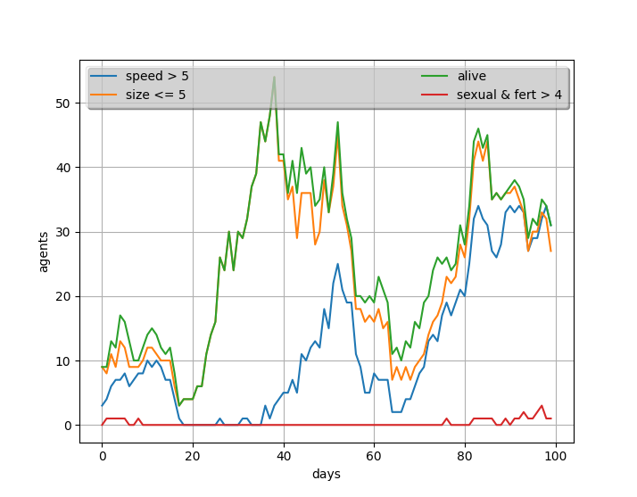
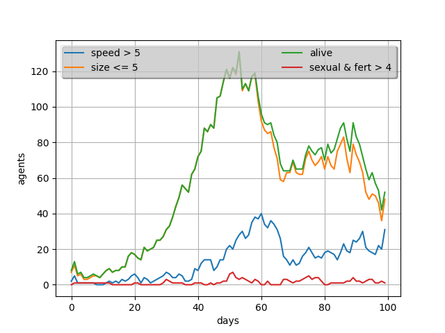
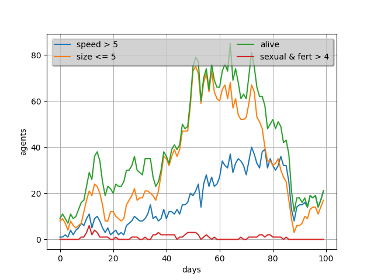

# Evolution Game

## Integrantes

- Miguel Alejandro Rodríguez Hernández - C311
- Manuel  Antonio Vilas Valiente - C311
- Andrés León Almaguer - C312

[TOC]

## Introducción 

El origen de las especies ha sido siempre un punto de gran interés para la humanidad. Hace ya muchos años, en la concepción del mundo dominaba la idea metafísica, la cual tenía como esencia el concepto de la continuidad, inmutabilidad y racionalidad inicial de toda la naturaleza. La Tierra, sus continentes, montes, clima, así como las especies de plantas y de animales serían perpetuos e inmutables.

Gracias a muchas investigaciones posteriores, en especial a las realizadas por Charles Darwin, esta idea cambió, y el concepto de evolución de las especies entró al juego. El mérito principal de Darwin consiste en que descubrió las fuerzas motrices de la evolución y explicó bajo el punto de vista materialista el origen y el carácter relativo de la adaptación como resultado solamente de la acción de leyes naturales sin la intervención de cualesquiera fuerzas sobrenaturales. La teoría de Darwin destruyó totalmente las ideas metafísicas acerca de la inmutabilidad de las especies. ¿Cuáles son las fuerzas motrices de la evolución de las razas de animales, las variedades de las plantas de cultivo y especies en la naturaleza salvaje?

> *La lucha por la existencia y la selección natural a base de la mutación hereditaria son, según Darwin, las fuerzas motrices principales (factores) de la evolución del mundo orgánico.*

La selección natural puede ser expresada con la siguiente ley general, tomada de la conclusión de *"El origen de las especies"*:

> Existen organismos que se reproducen y la progenie hereda características de sus progenitores, existen variaciones de características si el medio ambiente no admite a todos los miembros de  una población en crecimiento. Entonces aquellos miembros de la población con características menos adaptadas (según lo determine su medio  ambiente) morirán con mayor probabilidad. Entonces aquellos miembros con características mejor adaptadas sobrevivirán más probablemente.

Con estas bases sentadas, realizamos este proyecto, cuyo objetivo principal es simular el comportamiento de diferentes poblaciones de agentes, que serían los seres vivos en nuestro caso, en un entorno cerrado, donde estos deben de conseguir comida para poder sobrevivir y reproducirse. Al lograr esto último, dichos agentes pueden variar las composición de sus genes, que van desde el mecanismo de reproducción, el tipo de alimentación, o las capacidades que los hacen más o menos aptos para la supervivencia, lo que a su vez puede dar al traste con el cambio de su comportamiento. A lo largo del desarrollo del mismo hemos utilizado el conocimiento aprendido a lo largo del curso en las asignaturas de Simulación, Inteligencia Artificial y Compilación.

### Lenguaje y Requerimientos

El lenguaje de programación usado en el desarrollo del proyecto fue [Python](https://www.python.org), elegido sobre todo por el dominio de nosotros, los desarrolladores, y por el uso de algunas librerías que permitirían facilitar la implementación de algunas característas, que en este caso son [matplotlib](https://matplotlib.org), utilizada para graficar las estadísticas de cada una de las simulaciones, y [numpy](https://numpy.org), usada para el cálculo con matrices. 

Para el uso del proyecto recomendamos Python 3.9.xx e instalar estas librerías:

```bash
pip install matplotlib numpy
```

## La simulación

La simulación tendrá lugar dentro de un mundo bidimensional de casillas donde un conjunto de agentes inteligentes intentarán sobrevivir y reproducirse al competir por comida mientras que en el transcurso de los días, entiéndase día como un ciclo completo de la simulación, los descendientes de estos van a ir variando sus genes o características representativas tratando de acercarse a como funciona la evolución. Un agente sobrevive si en un día logra comer al menos una vez y regresar al borde, y un agente se reproduce si logra alimentarse más de una vez y de igual manera, regresar a un borde.

### El mapa 

El mundo esta representado por una clase `World`, que será el espacio donde ocurrirá la simulación, se encontrarán los agentes y otros objetos esenciales a la simulación. Este, a su vez, está compuesto por un `map`, que no es más que un arreglo de dos dimensiones, con unas dimensiones `x` y `y` que determinan el tamaño de este como el de la simulación en si, y posee en cada posición un objeto `Tile`. En esta clase tenemos un conjunto de métodos que permiten trabajar con las instancias de `Tile`, que nos facilitan informaciones estas, como saber si en dicha celda existe comida (`Food`), hay un árbol (`Tree`), es un borde, etc. En general, con esta clase podemos gestionar todo lo que sucede en el mundo donde transcurre la simulación.

La clase `Tile` es la unidad atómica de espacio en nuestro mundo. El tile tiene un conjunto de propiedades como son sus coordenadas `x` e `y`, si es un borde, si tiene comida (`Food`), agentes (`Agent`) o un árbol (`Tree`), así como un valor entero que determina la altitud del mismo dentro del mundo, una lista objetos (`Object_base`) que se encuentran dentro de la casilla y la lista de marcas de pisadas.

La clase `Objetc_base` servirá de molde para las clases que heredaran de ella y tiene como principal propiedad sus coordenadas. De esta tenemos como herederas a `Food`, `Tree` y `Agent`. La primera intuitivamente representa la comida que los agentes que presenten el tipo de alimentación omnívora y herbívora deben consumir para poder subsistir. Y los árboles tendrían la particularidad de ser localizaciones alrededor de las cuales tiende a existir un mayor número de comida, aunque poseen un tiempo de vida máximo. Los árboles también aparecen, con muy poco probabilidad, en un lugar donde hubo comida.

### Los agentes 

Los agentes tienen en las simulaciones un papel protagónico, pues podemos decir que la mayoría de las funciones dentro de las mismas los tienen a ellos como centro, y las interacciones entre estos y el ambiente es el objeto cuasi principal dentro dentro del proyecto, medir la cantidad de agentes dado un conjunto de simulaciones y parámetros a observar, cuál fue su comportamiento y cuáles eran las características que los definían nuestras principales variables de estudio.

La clase `Agent`, que representa al individuo que interactúa con el ambiente, está definida por su posición en el `map` (x,y), una lista de genes representativos del código genético que van a definir sus características, un `Behavior` que determina el conjunto de reglas (`rules`) que determinarán su comportamiento y de estados (`states`) en el que el agente puede encontrarse. 

Al definir un nuevo agente serán definidas algunas de sus propiedades como que está vivo (`is_alive`) su edad a 0, sus genes a partir de los genes usados como parámetros en el constructor, su energía máxima a partir del gen de *stamina*, la duración de su vida a partir del gen *life*, una función de consumo de energía predefinida. Tanto los estados como las reglas pueden ser definidos en el constructor y, en caso de no existir, una instancia de `Behavior` se encargará de darle al agente un comportamiento por defecto.

Dentro de los métodos que posee esta clase se encuentran aquellos que tienen que ver con el uso de su código genético, con los que podremos cambiar genes individuales o el conjunto entero de ellos así, como preguntar si el agente posee alguno en específico. Dentro de estos también tenemos los métodos de reproducción de los individuos en sus variantes sexual o asexual. En el caso de la reproducción sexual el resultado de la unión de dos individuos dará como resultado una lista de agentes que su tamaño dependerá del gen *fertility*, y estos hijos poseerán el comportamiento, `behavior`,  de alguno de los padres, además de que su configuración genética será una suma de los códigos de los padres. El caso de la reproducción asexual da como resultado un hijo con el mismo `behavior` que su progenitor y con un código genético alterado o mutado a partir del de su padre.

Otros del los métodos definidos dentro de la clase están aquellos relacionados con el movimiento y la apreciación del mapa de los agentes. Para observar el medio, los agentes tienen definido un gen sensorial, el cual indica cuántas casillas a su alrededor son capacer de apreciar. Las reglas del `behavior` del agente poseen una función reservada precisamente para el momento de la visualización, con esta, dicho agente analiza cada objeto que está observando y verifica si le es o no relevante para su futuro comportamiento. Finalmente, es devuelta una percepción del mundo.

#### El movimiento

Al momento de moverse, ocurre algo similar. Este método recibe la percepción del mundo, o sea, los límites de la observación del agente, y en este espacio realiza un conjunto de movimientos. El mejor camino posible para encontrar alimento, se pudiera calcular usando el algoritmo de Dijsktra, pero en términos de costo, esto representaría una opción muy lenta. Entonces, ¿qué hacer? Los agentes tienen, como ya dijimos, un conjunto de estados y un conjunto de reglas que definirán su comportamiento, entonces, ¿cómo estos pueden realizar un conjunto de movimientos inteligentes y que calcular dicho plan de acción no se vuelva algo poco eficiente? Pues, para resolver esto, los agentes calculan la probabilidad de que moverse hacia una posición sea lo mejor. 

En el comportamiento por defecto, definimos un grupo de variables a tener en cuenta, que son:

1. la distancia a la que están los alimentos,
2. la distancia a la que están los árboles,
3. la distancia a la que se encuentran los enemigos,
4. la distancia a la que se encuentran las posibles parejas,
5. la distancia a la que se encuentran los bordes,
6. la diferencia de altura entre una casilla y otra,
7. si la casilla ya la visitamos antes y
8. qué cantidad de marcas de pisadas hay en la casilla.

Para mejorar el problema de "lo más cerca de un grupo de objetos (la media), puede no llevarme nunca hacia un objeto en sí", no usamos la media común, sino una medida que aprendimos en el curso de SRI, con la cual se obtiene un valor que nos acerca al mínimo de los valores de una lista de números. Dada una lista de números $X$, se define la media como:
$$
mean(X) = \frac{N}{\sum_{i = 1}^N \frac{1}{x_i}}
$$
donde $N$ es el tamaño de la lista. En caso de $x_i = 0$, se asume que $1/x_i = 1$.

La fórmula general implica maximizar la distancia con respecto a las amenazas, y minimizar las distancias con respecto a los elementos beneficiarios.

Pero, si un agente ya se alimentó, quizás no debería ser muy importante para él volver a comer, ¿cómo solucionamos eso? Pues, para eso está la última función de cada `Rule` del `behavior`. Esta función nos indica cuán relevante debe ser, según el estado actual del agente, una de las reglas. Por ejemplo, si ya un agente está embarazado, no necesita seguir dándole importancia a la búsqueda de parejas, y el coeficiente de relevancia de esta regla será $0$. Lo mismo pasa con los bordes, si estos ya se alimentaron, no es necesario seguir vagando por el mapa, por lo cual la importancia para la mayoría de las reglas pasa a ser $0$, y la de la cercanía con los bordes pasa a ser la mayor, 1.

De esta forma, el agente en cada turno sabe qué debe priorizar para garantizar su supervivencia y su reproducción.

### Las acciones

Existe una clase `Action` que determina los cambios ocurridos en el mundo o el agente, de estas heredan un conjunto de otras acciones como son `DoNothing`, `MoveNorth`, `MoveSouth`, `MoveEast`, `MoveWest`, `Eat` y `HaveSex` que son bastante explicativas en sus nombres y tienen que ver como se intuye con el movimiento alimentación y reproducción respectivamente en los individuos.

### Los genes 

Como explicamos previamente, el código genético de cada individuo determina su comportamiento por lo que repercute de forma directa o indirecta en su comportamiento al incidir en las reglas que definen su `behavior`. Con el objetivo de poder variar parámetros dentro de las características de los individuos surge esta clase `Gene`, que va a representar cada una de estas características representativas del agente y la clase `Genetic_code` que representa al conjunto de los `Gene` que posee un `Agent` .

Cada Gene está definido por los valores mínimo y máximo que puede alcanzar de tipo enteros, el valor actual que posee, probabilidades de mutar y aumentar del tipo *float* y el tamaño del cambio que pueden llegar a realizar. La suma o unión de dos genes esta definida por default como el truncamiento a entero de la media de los valores de los genes. Al mutar un gene se devuelve un gen mutado con += el step que este posee en dependencia de una propiedad aleatoria sobrepase los umbrales de probabilidad de mutar y de aumentar, si solo muta decrecerá su valor y si muta y aumenta lo contrario. Además de poseer la posibilidad de implementar nuevas funciones de mutación para los mismos.

Dentro de los genes definidos para la simulación se encuentran:

- Sense:  Define la capacidad del agente de percibir el medio que le rodea.
- Size: Define su tamaño.
- Speed:  Velocidad del agente lo que determina la cantidad de casillas que puede desplazarse por ronda.
- Reproduction: Tipo de reproducción que posee el agente, sexual o asexual.
- Life: Duración de la vida del agente.
- Diet: Tipo de comida que consume, puede ser herbívoro, carnívoro u omnívoro.
- Sex: Sexo del agente, posee tres estados asexual, sexual femenino y sexual masculino.
- Fertility: Capacidad del agente de poseer un mayor número de descendientes.
- Stamina: Cantidad de energía del agente necesaria para desplazarse.


#### Tabla de valores por defecto de los genes 

|     Gen      | min_value | max_value | value | chance_to_mutate | chance_to_go_up | step |
| :----------: | :-------: | :-------: | :---: | :--------------: | :-------------: | :--: |
|    Sense     |     1     |    10     |   5   |       0.5        |       0.5       |  1   |
|     Size     |     1     |    10     |   5   |       0.5        |       0.5       |  1   |
|    Speed     |     1     |    10     |   5   |       0.5        |       0.5       |  1   |
| Reproduction |     1     |     2     |   1   |       0.5        |       0.9       |  1   |
|     Life     |     1     |    20     |  10   |       0.5        |       0.5       |  1   |
|     Diet     |     1     |     3     |   1   |       0.1        |       0.8       |  1   |
|     Sex      |     1     |     2     |   1   |        1         |        0        |  1   |
|  Fertility   |     1     |     8     |   4   |       0.5        |       0.5       |  1   |
|   Stamina    |    100    |   1000    |  400  |       0.5        |       0.5       |  10  |

En los casos de *Sense*, *Size*, *Speed*, *Life*, *Fertility* y *Stamina* su capacidad de mutar estará definida por el modo estándar  explicado anteriormente. Pero en los casos de *Reproduction*, *Diet* y *Sex* tendrán sus propios métodos de mutación. La mutación en la *Reproduction* sólo posee dos valores que representan el 1 del tipo asexual y el 2 del tipo sexual y las probabilidades de pasar de 1 a 2 (9/10) son mucho mayores que de 2 a 1 (1/9). El caso de *Diet* esta compuesta por una terna 1 herbívoros, 2 carnívoros y 3 omnívoros, al poseer altas posibilidades de mutar hacia arriba estos tenderán a mutar hacia omnívoros dado que si están en estado 1 y mutan tendrán una probabilidad del 4/5 de pasar al estado 3, ocurre lo mismo de con 2 con mayor tendencia hacia estado 3, y en el caso de poseer alimentación omnívora tendrá igual oportunidad de pasar a 1 o 2. El *Sex* tiene dos estados 1 femenino ♀ y 2 masculino ♂. 

El `Genetic_code` está compuesto por un diccionario de nombre del gen a `Gene` y será definido por una lista de genes no predeterminados definidos por el usuario que serán combinados con los estándares. Además de poseer la posibilidad de unir dos cadenas, mutar todos los genes de una cadena, preguntar por la existencia del algún `Gene` .

### El comportamiento

El comportamiento de los agentes está desacoplado de estos en sí, y se encuentra representado a través de la clase `Behavior`. Esta clase se encargará de agrupar las diferentes reglas y estados de comportamiento de los agentes. Cuando se inicializa, se construye el funcionamiento por defecto establecido, y además, son agregados todos los datos que el usuario desee modificar.

La capacidad de crear un objeto `Behavior` sin necesitar un agente, nos da la facilidad de diseñar un molde con el cual podrán funcionar varios agentes, sin tener que definir el mismo comportamiento una y otra vez.

Ahora, ¿qué son las reglas y los estados?

#### Las reglas

Las reglas están representadas por la clase `Rule`. Un objeto de este tipo, contendrá tres funciones, la primera `to_see`, es la función que define un comportamiento a la hora de observar el mundo, debe recibir un agente y un objeto, y retornar un valor booleano, True || False en dependencia de si un objeto cumple con una restricción con respecto al agente.

La segunda función, `to_move`, es la función que define cómo el agente valora una posición a la hora de moverse. A esta se le pasarán como parámetros una celda actual, una celda a la que nos moveremos, un mundo, un lista de las  casillas ya vistas y una lista de elementos relevante, retorna un valor numérico.

La última función es `to_relevance`, esta indica cuán relevante es una regla en dependencia del estado actual del agente. Debe retornar un valor entre 0 y 1.

Hay un conjunto de reglas ya definidas, las cuales se determinan el comportamiento predeterminado para un agente, estas son:

| Nombre de la regla          | Función                                  |
| --------------------------- | ---------------------------------------- |
| EatRule ("food")            | Regla para la alimentación.              |
| TreeRule ("tree")           | Regla para los árboles.                  |
| EnemiesRule ("enemies")     | Regla para las parejas.                  |
| ElevationRule ("elevation") | Regla para las diferencias de elevación. |
| EdgeRule ("edges")          | Regla para los bordes.                   |
| FootprintRule ("footprint") | Regla para las marcas de las pisadas.    |
| VisitedRule ("visited")     | Regla para las casillas ya visitadas.    |

#### Los estados

Los estados son representados a través la clase `State`. Un objeto estado posee un nombre, y una función que define si un agente se encuentra ahora en este estado, por lo cual recibe un agente, y retorna True||False.

Los estados predeterminados son:

| Nombre del estado | Función                                            |
| ----------------- | -------------------------------------------------- |
| "starve"          | El agente no ha comido en el día                   |
| "half"            | El agente está medio lleno, ha comido una sola vez |
| "full"            | El agente está lleno, ha comido más de una vez     |
| "pregnant"        | El agente está embarazado                          |
| "low_energy"      | Al agente le queda menos de la mitad de la energía |

### Las marcas en el suelo

También encontramos la clase `Footprint`, la cual se usa para representar las pisadas dejadas por un agente al trasladarse por una casilla, usada para ayudar a las agentes a tener un método de orientación dentro del terreno, ya que los agentes se mueven buscando comida y es probable que seguir a uno nos lleve a una buena posición.

### El simulador

El simulador es la clase que controla los procesos internos de la simulación, la pone a funcionar es la que posee al mundo y dentro de este, los agentes. Esta definida por un `world`, un conjunto de restricciones, los agentes el ciclo o día actual de la simulación y una función de comida. Entre las prestaciones con las que cuenta además de las de iniciar nuevos mundos definir una función de comida que nos permite determinar cuanta comida queremos que se genere dentro del tablero según que ciclo,  la posibilidad de agregar ciertas restricciones a la simulación para hacerla mas restrictiva, adicionar agentes, eliminarlos etc. 

Cada simulación esta dividida en días o ciclos, por cada día se pasa a ubicar la comida en los `Tiles` a partir de la función si esta existe, se simula una ronda donde cada uno de los agentes ejecuta una `Action`, se eliminan de esta aquellos que no pudieron llegar a conseguir comida, se reproducen aquellos que cumplan las condiciones para ello y se resetean sus estados para la próxima ronda así hasta que se llega al final de los días seleccionados por el usuario. Las estadísticas de cada unas de estas rondas son recogidas para luego ser mostradas. 

[FALTA]

[aqui pon el Master simulation que tuve que cambiarle el nombre pq no sabia si era el maestro simulador Simulator Master como tu lo tenias o Master simulation como lo traduje yo de tu docstring]   


## Manual de uso y ejemplos

### Ejemplo 1

Definir un agente.

```python
agent_1 = evolution.Agent()
```

### Ejemplo 2

Definir nuevos genes y con ellos definir un agente.

```python
gen_1 = evolution.Reproduction(value=2,chance_to_mutate=0)
gen_2 = evolution.Diet(value=2, chance_to_go_up=1)
agent_2 = evolution.Agent(genes=[gen_1, gen_2])
```

### Ejemplo 3

Establecer un comportamiento a un nuevo agente.

```python
behavior_1 = evolution.Behavior()
agent_3 = evolution.Agent(behavior = behavior_1)
```

### Ejemplo 4

```python
def diet(agent, element):
    if element.is_agent == True and element.genetic_code.get_code('diet') > 2:
        return True

def diet_move(*args):
    if len(elements) > 2:
        print(2)
    return 0

rule_1 = evolution.EatRule(to_relevance=lambda *args: 0.8)
rule_2 = evolution.Rule('diet', to_see = diet, to_move=diet_move ,to_relevance=lambda *args: 0.5)
behavior_2 = evolution.Behavior(rules=[rule_1, rule_2])
agent_4 = evolution.Agent(genes=[gen_1, gen_2], behavior=behavior_2)
```


### Ejemplo 5

Definir un agente a partir de genes y reglas definidas.

```
agent_5 = evolution.Agent(genes=[gen_1], rules=[rule_1, rule_2])
```


### Ejemplo 6

Definición de varias funciones de filtrado de agentes.

```python
# Función de filtrado 1
def func(ag: evolution.Agent):
    if (ag.genetic_code.get_gene('speed').value > 5):
        return True
    else:
        return False

# Función de filtrado 2
def func2(ag: evolution.Agent):
    if (ag.genetic_code.get_gene('size').value <= 5):
        return True
    else:
        return False

# Función de filtrado 3
def func3(ag: evolution.Agent):
    if (ag.is_alive):
        return True
    else:
        return False
    
# Función de filtrado 4
def func4(ag: evolution.Agent):
    if (ag.genetic_code.get_gene('reproduction').value == 2
        and ag.genetic_code.get_gene('fertility').value > 4):
        return True
    else:
        return False
```


### Ejemplo 7

Crear un simulador en un mundo de 50x50.

Define una función de comida.

Agrega 5 agentes y corre dicha simulación por 100 días mapeando los agentes que cumplen las funciones 1 2 3 y 4.

```python
s = evolution.Simulator()
s.create_world(50, 50, 10)

def func_food(simulation):
      return 500 - simulation.day

for i in range(5):
    s.add_agent_to_simulation(evolution.Agent())


s.simulate(days = 100,
           food_function=func_food,
           maping=[evolution.MapFunction('speed > 5',func),
                   evolution.MapFunction('size <= 5',func2),
                   evolution.MapFunction('alive',func3),
                   evolution.MapFunction('sexual & fert > 4',func4)],
           plot=1)
```


### Ejemplo 8

[FALTA]

```python
enemies = evolution.EnemiesRule(to_relevance=lambda *args: -1)
visited = evolution.VisitedRule(to_relevance=lambda *args: 1)

behavior_ = evolution.Behavior()
def func_agent():
      return [evolution.Agent() 
              for i in range(50)]
      
sm = evolution.MasterSimulator(trees=10, rounds=30, days=100)
sm.food_distribution = func_food
sm.agents_distribution = func_agent

sm.run(maping=[evolution.MapFunction('alive', func3),
            evolution.MapFunction('size <= 5',func2),
            evolution.MapFunction('speed > 5',func)])
```

### Ejemplos de los gráficos





